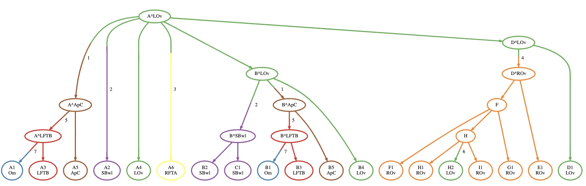
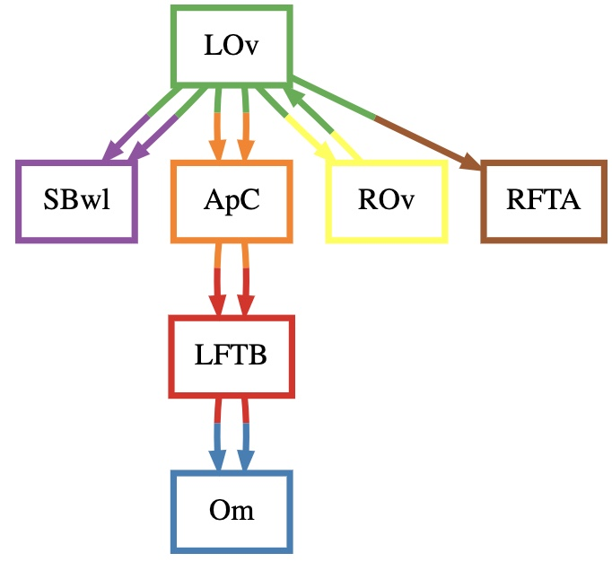

<!-- markdownlint-disable MD033 -->
<!-- markdownlint-disable MD036 -->
<!-- markdownlint-disable MD045 -->

# {: style="height:50px"} MACH2 Documentation

- **MACH2**: A mathematical framework for inferring migration histories of metastatic cancer from clone phylogeny and the location of extant clones.
- **MACH2-Viz**: An interactive visual application for exploring metastasis patterns

  
  

*Image: Clone tree labeled by MACH2 (left) and inferred migration graph for Ovarian cancer (right) (data from McPherson et. al., 2016)*

## Quick Start

- [Basic Features](feature.md)
- [Installation](installation.md)
