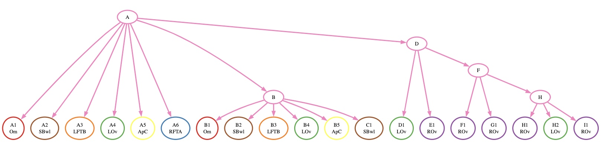
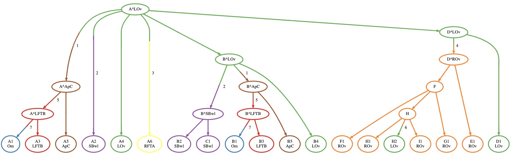
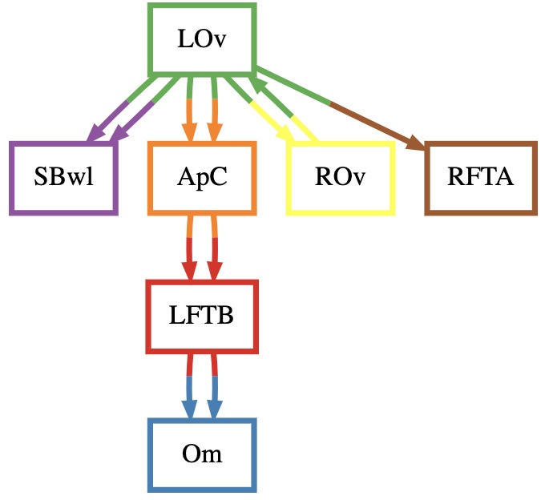

# Quick Start

**NOTE:** This tutorial is better followed on a Jupyter Notebook. To use a Jupyter notebook, be sure to install MACH2 for Jupyter Notebook.

Now that you have MACH2 and MACH2-Viz set up, you can run the following on this example dataset.

- [patient1.tree](https://github.com/elkebir-group/MACH2/blob/main/data/mcpherson_2016/patient1.tree)
- [patient1.labeling](https://github.com/elkebir-group/MACH2/blob/main/data/mcpherson_2016/patient1.labeling)

## Input Description

`patient1.tree` is the edgelist of the clone phylogeny to be labeled by MACH2, and `patient1.labeling` is a labeling of extant nodes (otherwise known as the *leaves* of the phylogeny) designating an anatomical location for these clones. As you can see, these are in tsv format, as columns can be separated by tabs or spaces.

## Visualizing the Tree

We visualize the tree through the following lines of Python code:

`In[1]:`

```python
import mach2
tree = mach2.Phylogeny.from_file('patient1.tree', 'patient1.labeling')
tree
```

`Out[1]`:



## Computing a Full Labeling

**NOTE:** Computing a full labeling using MACH2 requires an ILP solver such as Gurobi, make sure to have it installed.

To solve the PMH-TR (Parsimonious Migration History with Tree Resolution) problem, you can run the following code:

`In[2]`:

```python
solver = mach2.MACH(tree, primary_site='LOv')
solutions = solver.solve('gurobi', 30, n_threads=30)
```

`Out[2]`:

```text
Set parameter MIPGap to value 0
Set parameter PoolSolutions to value 30
Set parameter PoolSearchMode to value 2
Set parameter Threads to value 30
```

## Visualizing Solutions

You can visualize solutions using class methods in MACH2's library. Let's visualize the first solution returned by MACH2:

### Visualizing the Clone Tree

`In[3]`

```python
solutions[0].phylogeny
```

`Out[3]`



### Visualizing the Migration Graph

`In[4]`

```python
solutions[0].migration_graph
```

`Out[4]`

{: style="height:350px"}

### Opening MACH2-Viz

MACH2-Viz can be opened directly from the Jupyter Notebook via localhost through the following code

`In[5]`

```python
solutions.open_in_viz()
```

A browser window should open and display an interactive visualization of the solution space.
